# 🏗️ Storyboard AI - Architecture Documentation

## Overview

Storyboard AI is a client-side React application built with TypeScript, designed with a modular, privacy-first architecture. This document provides a comprehensive overview of the system architecture, design patterns, and organizational structure to facilitate better understanding and maintenance of this large codebase.

## 🎯 Core Design Principles

### 1. **Privacy-First Architecture**
- **Zero Backend Dependency**: All processing happens client-side
- **Local Storage Only**: Data never leaves the user's browser
- **API Key Security**: Direct client-to-service integration
- **No Tracking**: Zero telemetry or analytics collection

### 2. **Modular Component Design**
- **Single Responsibility**: Each component has a clear, focused purpose
- **Loose Coupling**: Components communicate through well-defined interfaces
- **High Cohesion**: Related functionality is grouped together
- **Reusability**: Components are designed for multiple use cases

### 3. **Scalable Context Management**
- **Hierarchical State**: Context providers at appropriate levels
- **Immutable State**: Predictable state updates using reducers
- **Event-Driven Architecture**: Actions trigger state changes
- **Performance Optimization**: Selective re-renders and memoization

## 🏛️ System Architecture

### High-Level Architecture

```mermaid
graph TB
    User[👤 User] --> UI[🎨 React UI Layer]
    UI --> Context[🔄 Context Layer]
    Context --> Services[⚙️ Service Layer]
    Services --> Storage[💾 Local Storage]
    Services --> AI[🤖 AI APIs]
    Services --> Utils[🛠️ Utility Layer]
    
    subgraph "Client-Side Only"
        UI
        Context
        Services
        Storage
        Utils
    end
    
    subgraph "External APIs"
        AI
    end
```



### Component Hierarchy

```
App.tsx
├── Header
│   ├── ThemeSelector
│   ├── ProjectControls
│   └── ViewToggle
├── MainContent
│   ├── StoryboardView
│   │   ├── StoryboardGrid
│   │   │   └── StoryboardPanel[]
│   │   └── AIAssistant
│   └── TimelineView
│       ├── TimelineControls
│       ├── TimelineTrack
│       └── TimelinePanel[]
└── Footer
    └── StatusBar
```

## 📂 Directory Structure & Context Management

### Source Organization

```
src/
├── components/          # Reusable UI Components
│   ├── ui/             # Base UI components
│   ├── panels/         # Storyboard panel components
│   ├── timeline/       # Timeline-specific components
│   ├── ai/            # AI assistant components
│   └── layout/        # Layout and navigation
├── context/           # React Context providers
│   ├── StoryboardContext.tsx
│   ├── ThemeContext.tsx
│   └── SettingsContext.tsx
├── services/          # Business logic & API services
│   ├── ai/           # AI service integrations
│   ├── storage/      # Local storage management
│   └── export/       # Export functionality
├── types/            # TypeScript type definitions
│   ├── storyboard.ts
│   ├── ai.ts
│   └── ui.ts
├── utils/            # Utility functions
│   ├── storage.ts
│   ├── validation.ts
│   └── helpers.ts
└── hooks/            # Custom React hooks
    ├── useStoryboard.ts
    ├── useAI.ts
    └── useLocalStorage.ts
```

### Context Management Strategy

#### 1. **StoryboardContext** (Primary State)
- **Scope**: Global application state
- **Responsibilities**:
  - Project management (create, load, save)
  - Panel management (add, edit, delete, reorder)
  - Timeline state
  - Export/import functionality

#### 2. **ThemeContext** (UI State)
- **Scope**: Application-wide theming
- **Responsibilities**:
  - Theme selection and persistence
  - CSS variable management
  - Theme-aware component rendering

#### 3. **SettingsContext** (Configuration)
- **Scope**: User preferences and configuration
- **Responsibilities**:
  - API key management
  - User preferences
  - Feature toggles

## 🔄 Data Flow Architecture

### State Management Pattern


### Action-Driven Updates

All state changes follow a predictable action-reducer pattern:

```typescript
// Action Types
type StoryboardAction = 
  | { type: 'ADD_PANEL'; payload: Panel }
  | { type: 'UPDATE_PANEL'; payload: { id: string; updates: Partial<Panel> } }
  | { type: 'DELETE_PANEL'; payload: string }
  | { type: 'REORDER_PANELS'; payload: { fromIndex: number; toIndex: number } }
  | { type: 'LOAD_PROJECT'; payload: Project }
  | { type: 'SAVE_PROJECT' }
  | { type: 'GENERATE_AI_CONTENT'; payload: AIGenerationRequest };

// Reducer Pattern
const storyboardReducer = (state: StoryboardState, action: StoryboardAction): StoryboardState => {
  switch (action.type) {
    case 'ADD_PANEL':
      return {
        ...state,
        panels: [...state.panels, action.payload],
        lastModified: Date.now()
      };
    // ... other cases
  }
};
```

## 🤖 AI Integration Architecture

### Service Layer Design


### AI Service Responsibilities

1. **Request Management**
   - Rate limiting and queuing
   - Error handling and retry logic
   - Response caching

2. **Content Generation**
   - Storyboard generation from prompts
   - Image generation via DALL-E 3
   - Video prompt creation

3. **Context Preservation**
   - Conversation history management
   - Project context awareness
   - Style consistency

## 🎨 Component Design Patterns

### 1. **Container-Presenter Pattern**

```typescript
// Container Component (Logic)
const StoryboardContainer: React.FC = () => {
  const { state, dispatch } = useStoryboard();
  const { generatePanel } = useAI();
  
  const handleAddPanel = useCallback(async (prompt: string) => {
    const panel = await generatePanel(prompt);
    dispatch({ type: 'ADD_PANEL', payload: panel });
  }, [dispatch, generatePanel]);
  
  return (
    <StoryboardPresenter
      panels={state.panels}
      onAddPanel={handleAddPanel}
      onUpdatePanel={handleUpdatePanel}
    />
  );
};

// Presenter Component (UI)
const StoryboardPresenter: React.FC<Props> = ({ panels, onAddPanel, onUpdatePanel }) => {
  return (
    <div className="storyboard-grid">
      {panels.map(panel => (
        <StoryboardPanel
          key={panel.id}
          panel={panel}
          onUpdate={onUpdatePanel}
        />
      ))}
    </div>
  );
};
```

### 2. **Custom Hook Pattern**

```typescript
// Encapsulate complex logic in custom hooks
const useStoryboard = () => {
  const context = useContext(StoryboardContext);
  if (!context) {
    throw new Error('useStoryboard must be used within StoryboardProvider');
  }
  return context;
};

const useAI = () => {
  const [isLoading, setIsLoading] = useState(false);
  const [error, setError] = useState<string | null>(null);
  
  const generateContent = useCallback(async (prompt: string) => {
    setIsLoading(true);
    setError(null);
    try {
      const result = await aiService.generate(prompt);
      return result;
    } catch (err) {
      setError(err.message);
      throw err;
    } finally {
      setIsLoading(false);
    }
  }, []);
  
  return { generateContent, isLoading, error };
};
```

## 🔧 Performance Optimization Strategies

### 1. **Component Memoization**
- React.memo for pure components
- useMemo for expensive calculations
- useCallback for stable function references

### 2. **Lazy Loading**
- Code splitting with React.lazy
- Dynamic imports for large components
- Progressive image loading

### 3. **State Optimization**
- Selector pattern for context consumers
- Local state for component-specific data
- Debounced updates for user input

### 4. **Bundle Optimization**
- Tree shaking for unused code
- Chunk splitting by routes/features
- Dynamic imports for optional features

## 🛡️ Security Architecture

### Privacy-First Design

1. **No Backend Requirements**
   - All processing client-side
   - No server-side data storage
   - No user tracking or analytics

2. **API Key Security**
   - Local storage encryption
   - Secure transmission protocols
   - User-controlled key management

3. **Content Security Policy**
   - Strict CSP headers
   - XSS protection
   - Resource validation

## 📊 Monitoring & Debugging

### Development Tools

1. **Context DevTools**
   - State inspection utilities
   - Action logging
   - Performance profiling

2. **Error Boundaries**
   - Graceful error handling
   - Error reporting (local only)
   - Recovery mechanisms

3. **Debug Mode**
   - Verbose logging
   - State dumps
   - Performance metrics

## 🔄 State Synchronization

### Cross-Component Communication


### Event-Driven Updates

- Custom event system for loose coupling
- Observer pattern for component communication
- Pub/sub for cross-cutting concerns

## 🚀 Deployment Architecture

### Build Process

1. **Development**
   - Hot module replacement
   - Source maps
   - Debug builds

2. **Production**
   - Minification and compression
   - Bundle analysis
   - Progressive web app features

3. **Static Hosting**
   - CDN optimization
   - Cache strategies
   - Service worker implementation

## 📈 Scalability Considerations

### Code Organization for Scale

1. **Feature-Based Organization**
   - Group related components
   - Shared utilities
   - Domain-specific types

2. **Module Federation**
   - Micro-frontend preparation
   - Independent deployments
   - Shared dependencies

3. **Progressive Enhancement**
   - Core functionality first
   - Optional features
   - Graceful degradation

## 🔍 Testing Architecture

### Testing Strategy

1. **Unit Tests**
   - Component testing
   - Utility function testing
   - Hook testing

2. **Integration Tests**
   - Context provider testing
   - Service integration
   - User workflow testing

3. **E2E Tests**
   - Critical path testing
   - Cross-browser validation
   - Performance testing

This architecture documentation serves as a living document that should be updated as the system evolves. It provides the necessary context for understanding the large codebase structure and design decisions. 