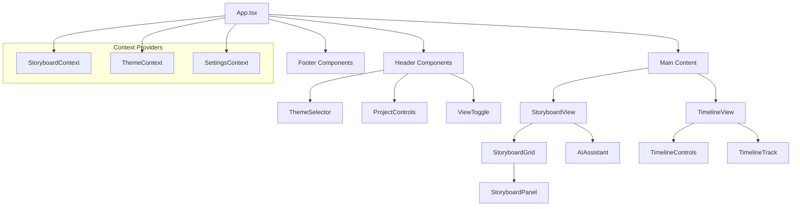
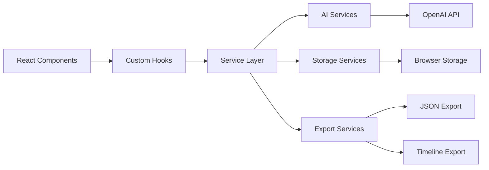

# 🧠 Context Management for Large Codebases

## Overview

This document outlines best practices and strategies for managing context in large codebases, specifically tailored for the Storyboard AI project. It incorporates insights from Model Context Protocol (MCP) implementation, semantic understanding techniques, and proven patterns for maintaining codebase comprehension at scale.

## 🎯 Context Management Principles

### 1. **Hierarchical Context Organization**

Context should be organized in layers, from broad architectural understanding to specific implementation details:

```
Global Context (Architecture & Patterns)
├── Domain Context (Business Logic Areas)
│   ├── Component Context (Feature Groups)
│   │   ├── Module Context (Individual Files)
│   │   └── Function Context (Specific Implementations)
│   └── Service Context (Utilities & APIs)
└── Cross-Cutting Context (Shared Concerns)
```

### 2. **Semantic Chunking Strategy**

Break down large codebases into semantically meaningful chunks that preserve logical relationships:

- **By Feature**: Group related functionality together
- **By Layer**: Separate UI, business logic, and data layers
- **By Domain**: Organize around business domains
- **By Dependency**: Group dependent components

### 3. **Context Preservation Techniques**

- **Maintain File Structure Awareness**: Understand how files relate within the directory hierarchy
- **Preserve Import/Export Relationships**: Track dependencies between modules
- **Document Interface Contracts**: Clear APIs between components
- **Semantic Relationships**: Understand business logic connections

## 🏗️ MCP Integration Strategies

### ConPort (Context Portal) Integration

ConPort provides the foundational layer for intelligent context management in large codebases:

#### Core Benefits
- **Persistent Knowledge Graph**: SQLite database maintains workspace-specific context across sessions
- **Semantic Search**: Vector embeddings enable intelligent similarity-based context retrieval
- **Structured Entities**: Organize decisions, patterns, glossary terms with explicit relationships
- **RAG Workflows**: Retrieval Augmented Generation enhances AI assistant capabilities
- **Cross-Reference Linking**: Build comprehensive knowledge graphs connecting related concepts

#### Implementation Strategy
```typescript
// Example ConPort workflow integration
const contextualDevelopment = async (feature: string) => {
  // 1. Query existing context
  const relevantContext = await getActiveContext({
    query: feature,
    includeTypes: ["decisions", "patterns", "glossary"]
  });
  
  // 2. Check architectural constraints
  const constraints = await getDecisions({
    category: "architecture",
    status: "active"
  });
  
  // 3. Find similar patterns
  const patterns = await semanticSearch({
    query: `${feature} implementation patterns`,
    threshold: 0.7
  });
  
  return { relevantContext, constraints, patterns };
};
```

For detailed ConPort implementation, see [CONPORT_INTEGRATION.md](./CONPORT_INTEGRATION.md) and [CONPORT_WORKFLOW.md](./CONPORT_WORKFLOW.md).

### Enhanced MCP Configuration

Our enhanced `mcp.json` configuration implements several context management optimizations:

#### 1. **Multi-Server Architecture**
```json
{
  "mcpServers": {
    "filesystem": "Local file system access with intelligent filtering",
    "git": "Version control context and change tracking", 
    "conport": "Custom context portal for enhanced analysis",
    "brave-search": "External knowledge integration"
  }
}
```

#### 2. **Context Optimization Settings**
```json
{
  "contextManagement": {
    "maxContextTokens": 100000,
    "contextPriority": "recent",
    "enableSemanticChunking": true,
    "preserveCodeStructure": true,
    "enableFileTypeAnalysis": true
  }
}
```

#### 3. **Large Codebase Optimizations**
- **Incremental Indexing**: Only process changed files
- **Project Structure Awareness**: Understand architectural patterns
- **Dependency Graphing**: Map component relationships
- **Smart File Filtering**: Focus on relevant code

## 📊 Context Prioritization Framework

### High Priority Context
1. **Architecture Documentation** (ARCHITECTURE.md, README.md)
2. **Type Definitions** (src/types/*.ts)
3. **Core Context Providers** (src/context/*.tsx)
4. **Main Application Entry** (src/App.tsx, src/main.tsx)
5. **Configuration Files** (package.json, tsconfig.json, vite.config.ts)

### Medium Priority Context
1. **Component Interfaces** (src/components/*/index.ts)
2. **Service Layer** (src/services/*.ts)
3. **Utility Functions** (src/utils/*.ts)
4. **Hook Implementations** (src/hooks/*.ts)

### Low Priority Context
1. **Styling Files** (*.css, *.scss)
2. **Test Files** (*.test.ts, *.spec.ts)
3. **Build Artifacts** (dist/, build/)

## 🔍 Intelligent File Filtering

### Include Patterns (High Value Files)
```json
[
  "src/**/*.{ts,tsx,js,jsx}",
  "*.{md,json,yml,yaml}",
  "package.json",
  "tsconfig.json",
  "vite.config.ts",
  "tailwind.config.js"
]
```

### Exclude Patterns (Low Value/Noise)
```json
[
  "node_modules/**",
  ".git/**",
  "dist/**",
  "build/**",
  "coverage/**",
  "*.log",
  "*.min.js",
  "*.map"
]
```

## 🏛️ Architectural Context Mapping

### Component Relationship Graph



### Service Layer Context



## 🧩 Modular Context Strategies

### 1. **Context Boundaries**

Define clear boundaries between different areas of the codebase:

```typescript
// Feature-based context boundaries
interface StoryboardFeature {
  components: ComponentContext;
  services: ServiceContext;
  types: TypeContext;
  hooks: HookContext;
}

// Cross-cutting concern boundaries
interface SharedContext {
  utils: UtilityContext;
  types: SharedTypeContext;
  constants: ConstantContext;
}
```

### 2. **Context Interfaces**

Document the interface between different context areas:

```typescript
// Clear API contracts between layers
interface UIToServiceContract {
  actions: ActionInterface;
  queries: QueryInterface;
  subscriptions: SubscriptionInterface;
}

interface ServiceToDataContract {
  persistence: PersistenceInterface;
  validation: ValidationInterface;
  transformation: TransformationInterface;
}
```

## 📖 Documentation-Driven Context

### 1. **Living Documentation**

Maintain documentation that evolves with the code:

- **README.md**: High-level project overview
- **ARCHITECTURE.md**: Detailed system design
- **CONTEXT_MANAGEMENT.md**: This document
- **Component READMEs**: Specific feature documentation

### 2. **Code Comments as Context**

Strategic commenting for context preservation:

```typescript
/**
 * StoryboardContext manages the global state for storyboard creation and editing.
 * 
 * Context Scope:
 * - Project lifecycle (create, load, save, export)
 * - Panel management (CRUD operations, reordering)
 * - Timeline state and playback controls
 * - AI generation state and caching
 * 
 * Related Components:
 * - StoryboardGrid: Consumes panel state
 * - TimelineView: Consumes timeline state  
 * - AIAssistant: Dispatches generation actions
 * 
 * Dependencies:
 * - StorageService: For project persistence
 * - AIService: For content generation
 * - ExportService: For data export
 */
export const StoryboardContext = createContext<StoryboardContextType | null>(null);
```

### 3. **Type-Driven Documentation**

Use TypeScript types as documentation:

```typescript
/**
 * Complete type definitions serve as living documentation
 * of the data structures and their relationships
 */
interface StoryboardPanel {
  id: string;
  /** 
   * Human-readable description of the scene
   * Used for AI generation and timeline display
   */
  description: string;
  
  /**
   * Generated or uploaded image for the panel
   * Stored as base64 data URL for privacy
   */
  imageUrl?: string;
  
  /**
   * Cinematographic metadata for professional workflows
   */
  shotType: ShotType;
  cameraAngle: CameraAngle;
  
  /**
   * Temporal information for timeline integration
   */
  duration: number; // milliseconds
  timestamp: number; // position in timeline
  
  /**
   * AI generation metadata for debugging and re-generation
   */
  aiMetadata?: {
    prompt: string;
    model: string;
    generatedAt: number;
    parameters: AIGenerationParameters;
  };
}
```

## 🔄 Dynamic Context Adaptation

### 1. **Context Evolution Tracking**

Track how context changes over time:

```typescript
interface ContextMetrics {
  complexity: {
    fileCount: number;
    lineCount: number;
    dependencyDepth: number;
    cyclomaticComplexity: number;
  };
  
  relationships: {
    componentDependencies: DependencyGraph;
    serviceConnections: ServiceMap;
    typeUsages: TypeUsageMap;
  };
  
  changeFrequency: {
    hotSpots: string[]; // frequently changed files
    stableAreas: string[]; // rarely changed files
    emergingPatterns: Pattern[];
  };
}
```

### 2. **Adaptive Context Loading**

Prioritize context based on current development activity:

```typescript
interface AdaptiveContextStrategy {
  // Load context based on current file being edited
  currentFileContext: ContextScope;
  
  // Related files based on imports/dependencies
  relatedFileContext: ContextScope;
  
  // Recently modified files (version control context)
  recentChangeContext: ContextScope;
  
  // Frequently accessed files (usage patterns)
  frequentAccessContext: ContextScope;
}
```

## 🎯 Context Quality Metrics

### 1. **Comprehension Metrics**

Measure how well context aids understanding:

- **Discovery Time**: How long to find relevant code
- **Integration Effort**: Time to make changes safely
- **Debugging Efficiency**: Speed of issue resolution
- **Onboarding Success**: New developer productivity

### 2. **Context Health Indicators**

Monitor context degradation:

```typescript
interface ContextHealth {
  documentation: {
    coverage: number; // % of code with documentation
    freshness: number; // documentation age vs code age
    accuracy: number; // documentation-code alignment
  };
  
  architecture: {
    coherence: number; // logical organization score
    dependencies: number; // coupling metrics
    patterns: number; // consistent pattern usage
  };
  
  discoverability: {
    searchability: number; // how easy to find things
    navigation: number; // logical file organization
    relationships: number; // clear component connections
  };
}
```

## 🛠️ Tools and Automation

### 1. **Context Generation Tools**

Automate context creation and maintenance:

- **Dependency analyzers**: Map component relationships
- **Documentation generators**: Extract context from code
- **Architecture visualizers**: Create diagrams from code
- **Pattern detectors**: Identify architectural patterns

### 2. **Context Validation**

Ensure context remains accurate:

- **Link checkers**: Verify documentation references
- **Consistency validators**: Check naming conventions
- **Dependency verifiers**: Validate import relationships
- **Coverage analyzers**: Identify undocumented areas

## 🚀 Implementation Roadmap

### Phase 1: Foundation (Current)
- ✅ Enhanced MCP configuration
- ✅ Architecture documentation
- ✅ Context management guidelines
- 🔄 Type system documentation

### Phase 2: Automation
- 📋 Automated dependency mapping
- 📋 Context health monitoring
- 📋 Documentation generation pipeline
- 📋 Pattern detection tools

### Phase 3: Intelligence
- 📋 Adaptive context loading
- 📋 Predictive context suggestions
- 📋 Intelligent code navigation
- 📋 Context-aware refactoring tools

## 📚 Additional Resources

### Best Practices References
1. **Clean Code Architecture** - Robert Martin
2. **Building Microservices** - Sam Newman  
3. **Domain-Driven Design** - Eric Evans
4. **The Pragmatic Programmer** - Hunt & Thomas

### Tooling Ecosystem
1. **MCP Documentation**: Model Context Protocol specifications
2. **TypeScript Handbook**: Type system best practices
3. **React Patterns**: Component design patterns
4. **Vite Guide**: Build tool optimization

This context management strategy ensures that our large codebase remains comprehensible, maintainable, and scalable as it continues to grow. 