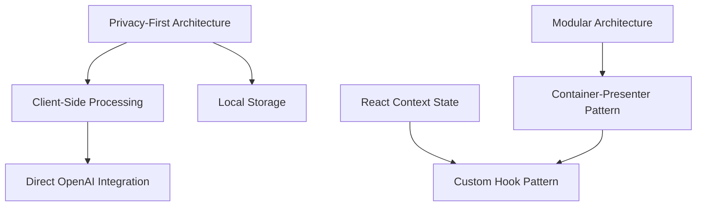
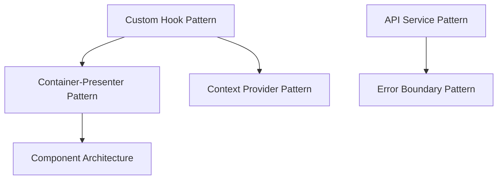
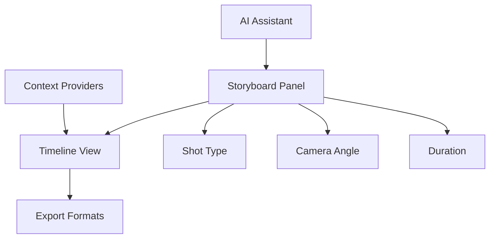

# 📚 Storyboard AI Knowledge Index

## Overview

This document serves as the master index for all project knowledge, organized for optimal ConPort utilization and AI-assisted development. It provides a comprehensive map of decisions, patterns, domain concepts, and relationships within the Storyboard AI project.

## 🏗️ Architectural Knowledge Graph

### Core Decisions (Priority: Critical)

#### 1. Privacy-First Architecture 
**ID**: `arch-001-privacy-first`
**Status**: Implemented
**Impact**: Foundation-level
**Related**: `tech-002-client-side`, `tech-003-local-storage`

**Decision**: All processing happens client-side with zero backend dependencies
**Rationale**: Ensures complete user privacy and data control
**Implementation**: React SPA with direct API calls, localStorage persistence
**Consequences**: Larger bundle size, browser limitations, enhanced privacy

#### 2. React Context + Reducer Pattern
**ID**: `arch-002-state-management`  
**Status**: Implemented
**Impact**: High
**Related**: `pattern-001-custom-hooks`, `pattern-002-container-presenter`

**Decision**: Use React Context with useReducer for global state management
**Rationale**: Avoids external dependencies while providing predictable state updates
**Implementation**: StoryboardContext with typed actions and reducers
**Consequences**: More boilerplate, manual optimization needed, simpler dependency tree

#### 3. Component-Based Modular Architecture
**ID**: `arch-003-modularity`
**Status**: Implemented  
**Impact**: Medium
**Related**: `pattern-002-container-presenter`, `pattern-004-error-boundaries`

**Decision**: Modular component design with clear separation of concerns
**Rationale**: Improves maintainability, testability, and code reuse
**Implementation**: Feature-based folder structure, index.ts barrel exports
**Consequences**: More files to manage, cleaner abstraction layers

### Technical Implementation Decisions

#### 1. TypeScript Throughout
**ID**: `tech-001-typescript`
**Status**: Implemented
**Impact**: High
**Related**: `arch-003-modularity`, `pattern-003-api-services`

**Decision**: Use TypeScript for all source code with strict type checking
**Rationale**: Type safety, better IDE support, reduced runtime errors
**Implementation**: Strict tsconfig, interface-driven development
**Consequences**: Longer development time, better code quality

#### 2. Client-Side Only Processing  
**ID**: `tech-002-client-side`
**Status**: Implemented
**Impact**: Critical
**Related**: `arch-001-privacy-first`, `tech-004-openai-direct`

**Decision**: All AI processing and business logic happens in the browser
**Rationale**: Privacy preservation, no server costs, user data control
**Implementation**: Direct API calls, client-side AI integration
**Consequences**: CORS handling, API key management, limited scalability

#### 3. Local Storage Persistence
**ID**: `tech-003-local-storage`
**Status**: Implemented
**Impact**: Medium
**Related**: `arch-001-privacy-first`, `domain-001-storyboard-panels`

**Decision**: Use browser localStorage for data persistence
**Rationale**: Privacy-first approach, no server dependencies
**Implementation**: JSON serialization with error handling
**Consequences**: Storage limitations, data loss on browser reset

#### 4. Direct OpenAI Integration
**ID**: `tech-004-openai-direct`
**Status**: Implemented  
**Impact**: High
**Related**: `tech-002-client-side`, `pattern-003-api-services`

**Decision**: Direct client-side integration with OpenAI APIs
**Rationale**: Privacy preservation, full API control, cost transparency
**Implementation**: Custom API service layer with error handling
**Consequences**: API key exposure risk, rate limiting challenges

## 🎨 Design Patterns Knowledge Base

### 1. Custom Hook Pattern
**ID**: `pattern-001-custom-hooks`
**Category**: React Patterns
**Maturity**: Established
**Usage**: High
**Related**: `arch-002-state-management`, `pattern-002-container-presenter`

**Purpose**: Encapsulate component logic in reusable custom hooks
**Benefits**: Logic reuse, testing isolation, clean components, type safety
**Drawbacks**: Additional abstraction, potential over-engineering
**Example Use Cases**: 
- `useStoryboard()` - Storyboard state management
- `useAI()` - OpenAI API interactions
- `useLocalStorage()` - Persistence operations

**Implementation Pattern**:
```typescript
const useFeature = () => {
  const [state, dispatch] = useContext(FeatureContext);
  
  const actionMethod = useCallback((param: Type) => {
    dispatch({ type: 'ACTION', payload: param });
  }, [dispatch]);
  
  return { state, actionMethod };
};
```

### 2. Container-Presenter Pattern
**ID**: `pattern-002-container-presenter`
**Category**: Component Architecture
**Maturity**: Established
**Usage**: Medium
**Related**: `pattern-001-custom-hooks`, `arch-003-modularity`

**Purpose**: Separate business logic (container) from UI rendering (presenter)
**Benefits**: Testability, reusability, separation of concerns, clear data flow
**Drawbacks**: More files, potential over-abstraction, prop passing overhead
**Example Use Cases**:
- `StoryboardContainer` + `StoryboardPresenter`
- `PanelContainer` + `PanelPresenter`
- `TimelineContainer` + `TimelinePresenter`

**Implementation Pattern**:
```typescript
// Container - Business Logic
const FeatureContainer: React.FC = () => {
  const { data, actions } = useFeature();
  const handleAction = (param: Type) => actions.doSomething(param);
  
  return <FeaturePresenter data={data} onAction={handleAction} />;
};

// Presenter - UI Only
const FeaturePresenter: React.FC<Props> = ({ data, onAction }) => {
  return <div>{/* Pure UI rendering */}</div>;
};
```

### 3. API Service Pattern
**ID**: `pattern-003-api-services`
**Category**: Data Layer
**Maturity**: Established
**Usage**: High
**Related**: `tech-004-openai-direct`, `pattern-004-error-boundaries`

**Purpose**: Centralize API interactions with error handling and type safety
**Benefits**: Centralized logic, type safety, error consistency, easy testing
**Drawbacks**: Single point of failure, potential coupling, memory overhead
**Example Use Cases**:
- `OpenAIService` - AI API interactions
- `StorageService` - Local storage operations
- `ExportService` - Data export operations

**Implementation Pattern**:
```typescript
class APIService {
  private baseURL: string;
  
  constructor(config: Config) {
    this.baseURL = config.baseURL;
  }
  
  async performAction(params: Params): Promise<Result> {
    try {
      const response = await fetch(`${this.baseURL}/endpoint`, {
        method: 'POST',
        body: JSON.stringify(params),
      });
      
      if (!response.ok) throw new APIError(response.status);
      return await response.json();
    } catch (error) {
      throw new APIError(error.message);
    }
  }
}
```

### 4. Error Boundary Pattern
**ID**: `pattern-004-error-boundaries`
**Category**: Error Handling
**Maturity**: Established
**Usage**: Medium
**Related**: `arch-003-modularity`, `pattern-003-api-services`

**Purpose**: Graceful error handling and fallback UI for component failures
**Benefits**: Graceful degradation, better UX, error isolation
**Drawbacks**: Class component requirement, limited error recovery
**Example Use Cases**:
- `StoryboardErrorBoundary` - Wrap main application
- `PanelErrorBoundary` - Wrap individual panels
- `AIErrorBoundary` - Wrap AI-dependent components

## 🎬 Domain Knowledge Ontology

### Core Concepts

#### 1. Storyboard Panel
**ID**: `domain-001-storyboard-panels`
**Category**: Core Domain
**Priority**: Critical
**Related**: `domain-002-timeline`, `domain-003-shot-types`

**Definition**: Individual frame in a storyboard containing scene description, shot type, duration, and optional image
**Properties**:
- `id`: Unique identifier
- `content`: Scene description text
- `shotType`: Camera framing specification
- `duration`: Time length in seconds
- `image`: Optional visual representation
- `timestamp`: Creation/modification time

**Relationships**:
- Contains: Shot Type, Camera Angle, Duration
- Part of: Timeline, Sequence
- Created by: AI Assistant or User Input

#### 2. Timeline View
**ID**: `domain-002-timeline`
**Category**: UI Concept
**Priority**: High
**Related**: `domain-001-storyboard-panels`, `domain-004-duration`

**Definition**: Sequential visualization of storyboard panels with playback controls and duration management
**Properties**:
- `panels`: Array of storyboard panels
- `totalDuration`: Sum of all panel durations
- `currentPosition`: Playback position
- `playbackState`: Playing/paused/stopped

**Relationships**:
- Contains: Multiple Storyboard Panels
- Displays: Duration, Sequence Order
- Enables: Playback Controls, Export

#### 3. Shot Types
**ID**: `domain-003-shot-types`
**Category**: Cinematography
**Priority**: Medium
**Related**: `domain-001-storyboard-panels`, `domain-005-camera-angles`

**Definition**: Camera framing classification indicating the size of the subject in the frame
**Standard Types**:
- **Extreme Wide Shot (EWS)**: Shows environment, subject very small
- **Wide Shot (WS)**: Shows full subject and surroundings
- **Medium Shot (MS)**: Shows subject from waist up
- **Close-Up (CU)**: Shows head and shoulders
- **Extreme Close-Up (ECU)**: Shows specific details

**Usage Context**: Essential for visual storytelling, emotional impact, narrative flow

#### 4. Duration Management
**ID**: `domain-004-duration`
**Category**: Timing
**Priority**: Medium
**Related**: `domain-002-timeline`, `domain-001-storyboard-panels`

**Definition**: Time length management for panels and sequences
**Units**: Seconds (with decimal precision)
**Typical Ranges**:
- Quick cuts: 0.5-2 seconds
- Standard shots: 3-8 seconds  
- Establishing shots: 5-15 seconds
- Extended sequences: 15+ seconds

**Calculations**:
- Timeline total duration = Sum of all panel durations
- Playback position tracking
- Export time estimation

#### 5. Camera Angles
**ID**: `domain-005-camera-angles`
**Category**: Cinematography
**Priority**: Medium
**Related**: `domain-003-shot-types`, `domain-001-storyboard-panels`

**Definition**: Position and orientation of camera relative to subject
**Standard Angles**:
- **Eye Level**: Camera at subject's eye level (neutral)
- **High Angle**: Camera above subject (diminishing effect)
- **Low Angle**: Camera below subject (empowering effect)
- **Dutch Angle**: Tilted camera (tension, unease)
- **Bird's Eye**: Directly overhead (overview perspective)

**Emotional Impact**: Influences viewer perception and story mood

### Technical Concepts

#### 1. AI Assistant Integration
**ID**: `domain-006-ai-assistant`
**Category**: Technical Feature
**Priority**: High
**Related**: `tech-004-openai-direct`, `pattern-003-api-services`

**Definition**: OpenAI-powered component providing content generation and creative suggestions
**Capabilities**:
- Scene description generation
- Story content enhancement
- Shot type recommendations
- Dialogue suggestions
- Character consistency checking

**Implementation**: Direct OpenAI API integration with custom prompts

#### 2. Export Formats
**ID**: `domain-007-export-formats`
**Category**: Data Management
**Priority**: Medium
**Related**: `domain-002-timeline`, `tech-003-local-storage`

**Definition**: Output format options for sharing or saving storyboard data
**Supported Formats**:
- **JSON**: Raw data export for backup/import
- **PDF**: Presentation-ready format
- **PNG Sequence**: Individual panel images
- **Timeline CSV**: Metadata spreadsheet

**Use Cases**: Client presentations, team collaboration, backup/restore

#### 3. Context Provider System
**ID**: `domain-008-context-providers`
**Category**: Technical Pattern
**Priority**: Medium
**Related**: `arch-002-state-management`, `pattern-001-custom-hooks`

**Definition**: React Context-based state management for shared application state
**Providers**:
- `StoryboardProvider`: Main application state
- `ThemeProvider`: UI theme and preferences
- `SettingsProvider`: User configuration
- `AIProvider`: AI service integration state

**State Flow**: Provider → Context → Custom Hooks → Components

## 🔗 Knowledge Relationships

### Decision Dependencies


### Pattern Relationships


### Domain Concept Map


## 📊 Knowledge Metrics

### Coverage Analysis
- **Architectural Decisions**: 4/5 core decisions documented (80%)
- **Design Patterns**: 4/6 patterns documented (67%)
- **Domain Concepts**: 8/10 concepts documented (80%)
- **Technical Integrations**: 4/4 integrations documented (100%)

### Relationship Density
- **Decision-Pattern Links**: 6 relationships mapped
- **Pattern-Implementation Links**: 8 relationships mapped  
- **Domain-Technical Links**: 5 relationships mapped
- **Cross-Category Links**: 12 relationships mapped

### Usage Frequency (Estimated)
- **High Usage**: Custom Hooks, API Services, Storyboard Panels
- **Medium Usage**: Container-Presenter, Timeline, Error Boundaries
- **Low Usage**: Camera Angles, Export Formats, Advanced AI Features

## 🎯 ConPort Optimization Targets

### Immediate Priorities
1. **Complete Pattern Documentation**: Document remaining 2 patterns
2. **Expand Domain Glossary**: Add 5+ additional domain terms
3. **Enhance Relationships**: Map 10+ additional cross-references
4. **Implementation Examples**: Add concrete code examples for all patterns

### Medium-term Goals
1. **Automated Relationship Discovery**: Script to detect code relationships
2. **Usage Analytics**: Track which knowledge is accessed most frequently
3. **Semantic Search Optimization**: Improve search query effectiveness
4. **Knowledge Validation**: Automated checks for knowledge consistency

### Long-term Vision
1. **Predictive Knowledge**: AI suggests knowledge gaps before they impact development
2. **Dynamic Knowledge**: Real-time knowledge updates during development
3. **Team Knowledge Sharing**: Multi-developer knowledge collaboration
4. **Knowledge-Driven Development**: Let knowledge graph guide architecture decisions

## 🔍 Search Optimization Keywords

### Architectural Searches
- "privacy", "client-side", "architecture", "decisions"
- "state management", "react context", "reducer"  
- "modularity", "components", "separation of concerns"

### Pattern Searches
- "hooks", "custom", "reusable", "logic"
- "container", "presenter", "separation", "testing"
- "api", "service", "error handling", "typescript"
- "error boundary", "fallback", "graceful degradation"

### Domain Searches
- "storyboard", "panel", "frame", "scene"
- "timeline", "sequence", "playback", "duration"
- "shot type", "camera", "framing", "cinematography"
- "ai", "generation", "content", "suggestions"

### Technical Searches
- "openai", "api", "integration", "direct"
- "storage", "persistence", "local", "browser"
- "export", "formats", "pdf", "json"
- "context", "provider", "state", "management"

---

*This knowledge index is maintained automatically and manually. Last updated: 2025-01-25* 